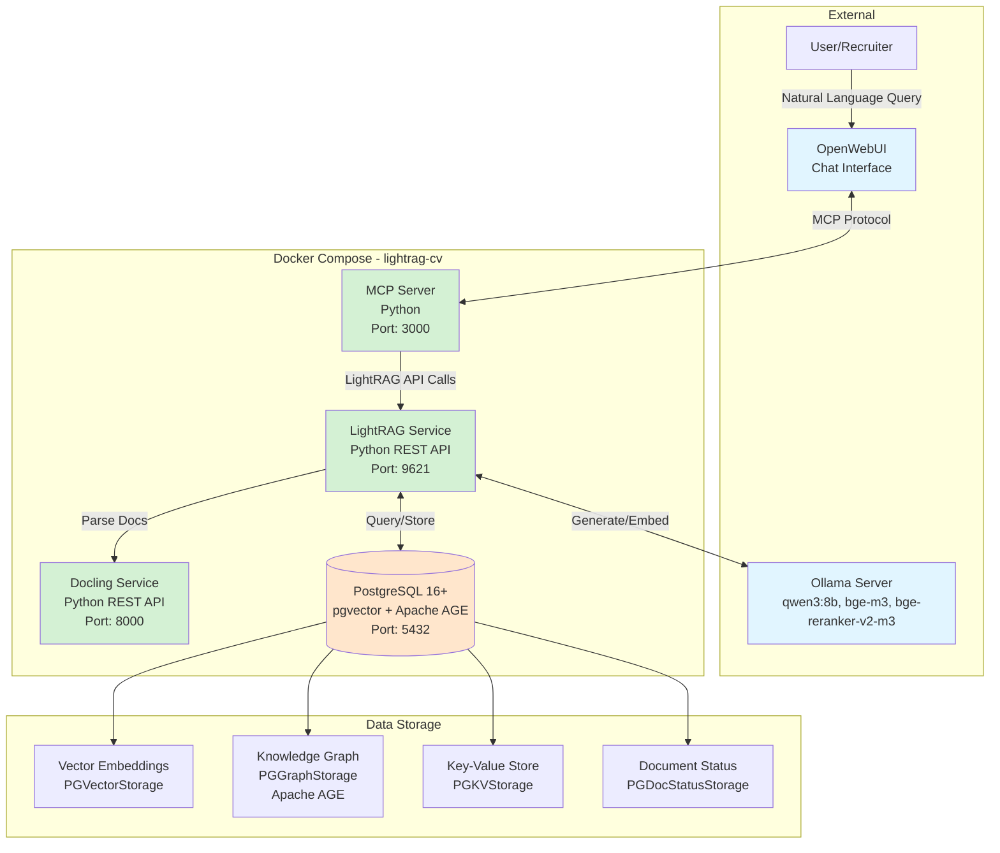
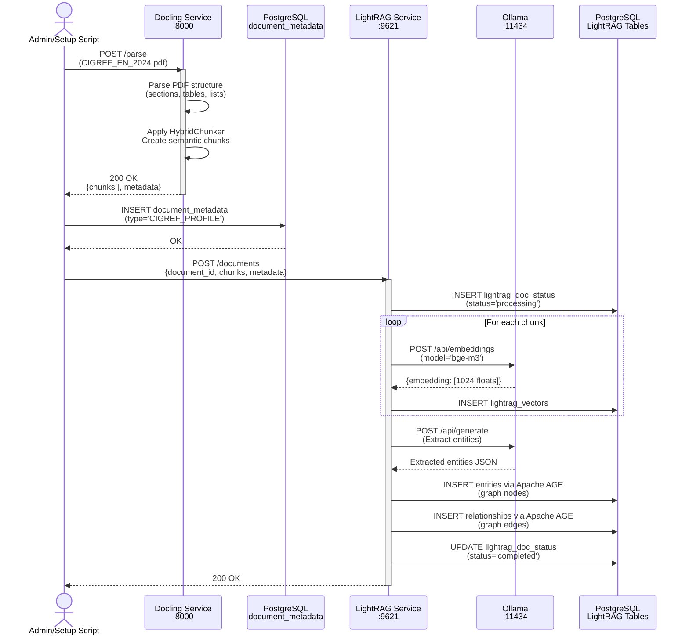
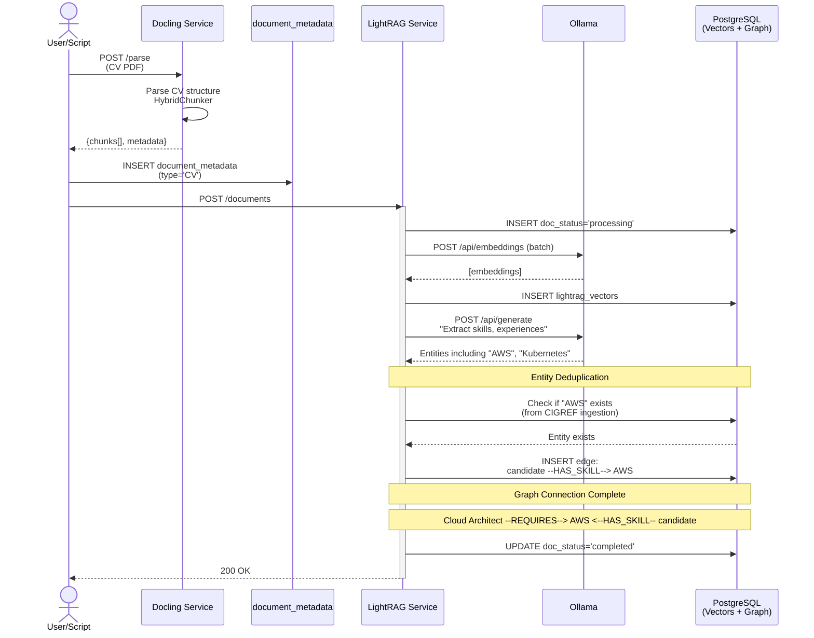
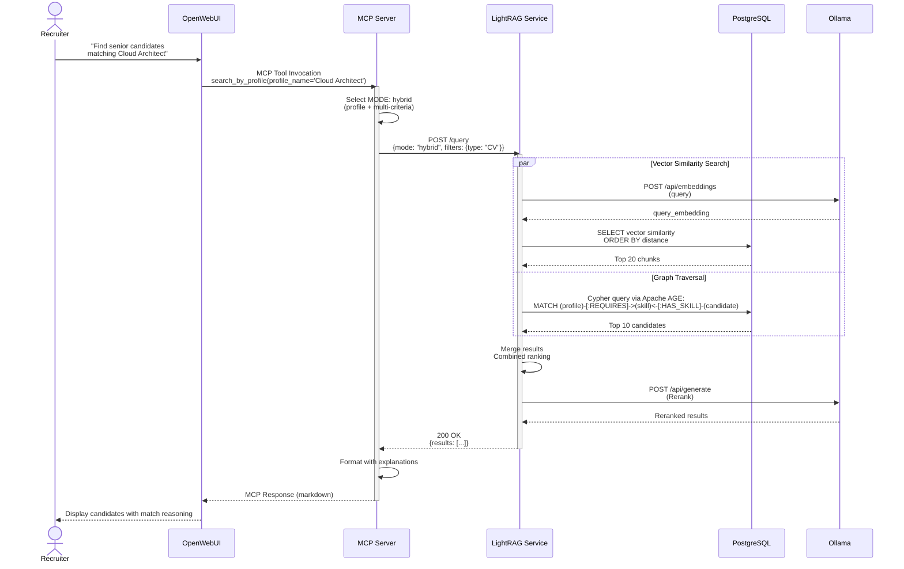

# LightRAG-CV Architecture Document

## Introduction

This document outlines the overall project architecture for **LightRAG-CV**, including backend systems, shared services, and infrastructure concerns. Its primary goal is to serve as the guiding architectural blueprint for AI-driven development, ensuring consistency and adherence to chosen patterns and technologies.

**Project Context:** LightRAG-CV is a proof-of-concept (POC) system that validates hybrid vector-graph RAG technology for intelligent CV-to-job-profile matching in IT recruitment. The system ingests CIGREF IT profile nomenclature and candidate CVs, creating a unified knowledge base accessible through natural language queries via OpenWebUI.

**Architectural Focus:** This document focuses on the backend microservices architecture, data storage, and integration patterns. Since the UI is provided by an external service (OpenWebUI), this architecture addresses service design, API contracts, database schemas, and deployment infrastructure running on Windows WSL2 with Docker Compose.

### Starter Template or Existing Project

**Analysis:** The PRD specifies a custom Docker Compose-based microservices architecture rather than a pre-existing starter template. Key architectural components are based on specific technologies:

- **LightRAG**: Using HKUDS/LightRAG library with custom PostgreSQL storage adapters
- **Docling**: IBM's document processing library wrapped in a REST service
- **MCP Server**: Custom implementation following Model Context Protocol specification
- **PostgreSQL**: Custom configuration with pgvector (0.5.0+) and Apache AGE extensions

**Decision:** **N/A - Greenfield project** with custom integration of multiple specialized libraries. The monorepo structure defined in the PRD will be implemented from scratch following Docker Compose best practices for microservices orchestration.

**Constraints:**
- Must use LightRAG's PostgreSQL storage adapters (PGKVStorage, PGVectorStorage, PGGraphStorage, PGDocStatusStorage)
- Docling service must support optional GPU acceleration via Docker Compose profiles
- MCP server implementation constrained by Model Context Protocol specification
- All services must communicate via internal Docker network with configurable ports

### Change Log

| Date | Version | Description | Author |
|------|---------|-------------|---------|
| 2025-11-03 | v1.0 | Initial architecture document created from PRD v1.0 | Winston (Architect) |

---

## High Level Architecture

### Technical Summary

LightRAG-CV employs a **containerized microservices architecture** orchestrated via Docker Compose, designed for local deployment on Windows WSL2 with Docker Desktop. The system integrates four core services—Docling (document processing), LightRAG (hybrid vector-graph RAG engine), PostgreSQL (unified persistence with pgvector and Apache AGE extensions), and a custom MCP Server (Model Context Protocol integration)—with external dependencies on Ollama (LLM inference/embeddings) and OpenWebUI (user interface). The architecture leverages hybrid retrieval combining vector similarity search and graph relationship traversal to match IT candidate CVs against CIGREF job profile nomenclature, exposing capabilities through a conversational interface. This POC architecture prioritizes rapid validation of the hybrid RAG hypothesis while maintaining clear service boundaries and data architecture that can scale to production requirements.

### High Level Overview

**Architectural Style:** **Microservices within Docker Compose**

The system follows a microservices pattern with clear service boundaries, containerized for consistent deployment across development and testing environments. While not a full-scale distributed system (appropriate for single-user POC scope), the architecture establishes service isolation principles that enable future scaling.

**Repository Structure:** **Monorepo** (`lightrag-cv/`)

All services, configuration, documentation, and deployment artifacts reside in a single repository following the structure:
```
lightrag-cv/
├── services/          # Service implementations
│   ├── docling/       # Document processing service
│   ├── lightrag/      # RAG engine service
│   ├── mcp-server/    # MCP protocol server
│   └── postgres/      # Database configuration
├── data/              # Reference data and test datasets
├── docs/              # Architecture and requirements
├── scripts/           # Setup and utility scripts
└── docker-compose.yml # Orchestration configuration
```

**Service Architecture:**

1. **Docling Service** - Stateless Python REST API wrapping IBM's Docling library for intelligent document parsing with HybridChunker support. Optionally GPU-accelerated for performance.

2. **LightRAG Service** - Python-based RAG engine from HKUDS/LightRAG, configured with PostgreSQL storage adapters for vectors, graphs, key-value pairs, and document status tracking. Exposes REST API for document ingestion and retrieval operations.

3. **MCP Server** - Custom Python implementation of Model Context Protocol specification, translating OpenWebUI tool invocations into LightRAG API calls and formatting structured responses.

4. **PostgreSQL Database** - Unified persistence layer with pgvector (0.5.0+) for vector similarity search and Apache AGE for graph database capabilities. Serves as single source of truth for embeddings, knowledge graph, and metadata.

**External Dependencies:**

- **Ollama** (host or separate container): LLM inference server providing qwen3:8b (generation), bge-m3 (1024-dim embeddings), and bge-reranker-v2-m3 (reranking)
- **OpenWebUI** (external service): Conversational UI invoking MCP server tools via Model Context Protocol

**Data Flow (Conceptual):**

1. **Ingestion Flow:** PDF/DOCX → Docling parsing → LightRAG ingestion → PostgreSQL storage (vectors + graph)
2. **Retrieval Flow:** OpenWebUI natural language query → MCP Server tool invocation → LightRAG retrieval (hybrid mode selection) → PostgreSQL query (vectors + graph traversal) → Ollama generation → MCP formatted response → OpenWebUI display

**Key Architectural Decisions:**

- **Unified PostgreSQL Storage:** Single database with extensions eliminates multi-database complexity and enables ACID transactions across vectors and graphs
- **Service Communication via REST:** HTTP APIs over internal Docker network provide clear contracts and debugging transparency
- **MCP Protocol Abstraction:** Decouples LightRAG capabilities from OpenWebUI implementation details
- **External Ollama:** Leverages existing LLM inference infrastructure rather than bundling models in containers
- **Configurable Ports:** `.env`-based port configuration prevents conflicts in Docker Desktop environment

### High Level Project Diagram



### Architectural and Design Patterns

- **Microservices Architecture:** Independent services with clear boundaries and REST APIs - *Rationale:* Enables parallel development of Docling, LightRAG, and MCP components; supports future scaling by service; aligns with PRD's service architecture specification.

- **API Gateway Pattern (MCP Server):** Single entry point for OpenWebUI interactions - *Rationale:* Abstracts LightRAG complexity from UI layer; enables intelligent retrieval mode selection; provides unified error handling and response formatting.

- **Repository Pattern (via Storage Adapters):** LightRAG's PGKVStorage, PGVectorStorage, PGGraphStorage, PGDocStatusStorage abstract data access - *Rationale:* Decouples RAG logic from PostgreSQL implementation; enables future database migration if needed; follows LightRAG library's design.

- **Adapter Pattern (Docling Service):** REST wrapper around Docling library - *Rationale:* Decouples document processing from LightRAG service; enables independent scaling and GPU acceleration; provides version isolation.

- **Hybrid Retrieval Pattern:** Combines vector similarity (semantic search) with graph traversal (relationship reasoning) - *Rationale:* Core POC hypothesis - graph relationships improve match quality beyond pure vector similarity; supports explainable recommendations.

- **External Service Integration:** Ollama accessed via HTTP rather than embedded - *Rationale:* Leverages existing LLM infrastructure; avoids bundling large models in containers; supports shared Ollama instance across projects.

- **Configuration as Code:** Docker Compose + `.env` for all infrastructure - *Rationale:* Reproducible environments; version-controlled infrastructure; supports both CPU and GPU profiles for Docling.

- **Stateless Services:** All services except PostgreSQL are stateless - *Rationale:* Simplifies container restarts and updates; state centralized in database; supports future horizontal scaling.

- **Protocol-Based Integration (MCP):** Standard protocol for OpenWebUI integration - *Rationale:* Decouples from OpenWebUI implementation details; enables alternative UIs in Phase 2; follows emerging LLM tooling standards.

---

## Tech Stack

⚠️ **CRITICAL SECTION** ⚠️
This is the **DEFINITIVE technology selection** for LightRAG-CV. All development, testing, and deployment MUST use these exact versions. This table is the **single source of truth** - no deviations without architecture revision.

### Cloud Infrastructure

**Platform:** Local Development (No Cloud Provider)
**Deployment Host:** Windows WSL2 (Ubuntu 22.04 LTS recommended) with Docker Desktop
**Orchestration:** Docker Compose v2.x
**Networking:** Single Docker bridge network (`lightrag-cv-network`)

**Rationale:** POC scope requires local-only processing for CV data privacy (no cloud APIs per NFR9). WSL2 provides Linux container support on Windows development machines. Docker Compose sufficient for single-user POC; Kubernetes migration path available for Phase 2.

### Technology Stack Table

| Category | Technology | Version | Purpose | Rationale |
|----------|-----------|---------|---------|-----------|
| **Container Runtime** | Docker Desktop | 4.25+ | Container orchestration on WSL2 | Native Windows WSL2 integration; GPU support via nvidia-docker runtime; team familiarity |
| **Orchestration** | Docker Compose | 2.23+ | Multi-container application definition | Sufficient for POC scope; declarative configuration; profile support for GPU/CPU modes |
| **Primary Language** | Python | 3.11.x | Service implementation language | LightRAG and Docling ecosystem compatibility; strong AI/ML library support; type hints for maintainability |
| **Database** | PostgreSQL | 16.1 | Unified persistence layer | Required for pgvector 0.5.0+ compatibility; stable LTS; Apache AGE extension support |
| **Vector Extension** | pgvector | 0.5.1 | Vector similarity search | Native PostgreSQL vector operations; 1024-dim embedding support for bge-m3; LightRAG PGVectorStorage requirement |
| **Graph Extension** | Apache AGE | 1.5.0 | Graph database capabilities | Cypher query support; LightRAG PGGraphStorage requirement; OpenCypher compatibility |
| **RAG Engine** | LightRAG (HKUDS) | 0.0.0.post8 | Hybrid vector-graph retrieval | Core POC technology; PostgreSQL storage adapter support; hybrid mode selection; proven architecture |
| **Document Processing** | Docling | 1.16.2 | PDF/DOCX parsing with structure | HybridChunker for intelligent segmentation; table/list extraction; optional GPU acceleration |
| **MCP Server Language** | Python | 3.11.x | MCP protocol implementation | Ecosystem consistency with other services; Python MCP SDK availability |
| **MCP SDK** | mcp (Python) | 0.9.0 | Model Context Protocol library | Official Python SDK; OpenWebUI compatibility (validate in Week 1 spike); simpler than TypeScript for POC |
| **LLM Inference** | Ollama | 0.3.12 | Local LLM serving | Multi-model support; efficient quantization; host.docker.internal access from containers |
| **Generation Model** | qwen3:8b | latest | Query response generation | 40K context window (OLLAMA_LLM_NUM_CTX=40960); multilingual but English-optimized; 8B param balances quality/speed |
| **Embedding Model** | bge-m3 | latest | 1024-dim vector embeddings | Multilingual (English-optimized); 1024-dim matches pgvector config; SOTA semantic similarity |
| **Reranking Model** | bge-reranker-v2-m3 | latest (xitao/bge-reranker-v2-m3) | Result reranking | Improves precision@5 (NFR4 target: 70%); cross-encoder architecture; compatible with bge-m3 |
| **Python Package Manager** | pip | 23.3+ | Dependency management | Standard Python tooling; requirements.txt per service; virtual environments in containers |
| **Web Framework (Docling)** | FastAPI | 0.109.0 | REST API framework | Async support; auto OpenAPI docs; type validation via Pydantic; modern Python standard |
| **Web Framework (LightRAG)** | FastAPI | 0.109.0 | REST API framework | Consistency with Docling; LightRAG API module compatibility; excellent async I/O for embeddings |
| **HTTP Client** | httpx | 0.26.0 | Async HTTP requests | MCP→LightRAG, LightRAG→Ollama communication; async/await support; connection pooling |
| **PostgreSQL Client** | psycopg3 | 3.1.16 | Database driver | PostgreSQL 16 compatibility; async support; native prepared statements |
| **Logging** | Python logging (stdlib) | 3.11.x | Service logging | Sufficient for POC; Docker Compose log aggregation; structured JSON logs optional |
| **Environment Config** | python-dotenv | 1.0.0 | .env file loading | Centralized configuration; prevents hardcoded credentials; Docker Compose variable substitution |
| **Testing Framework** | pytest | 7.4.3 | Manual test scripts | Industry standard; fixture support; minimal for POC (manual testing primary per PRD) |
| **Code Quality** | ruff | 0.1.9 | Linting and formatting | Fast Python linter/formatter; replaces Black+Flake8+isort; minimal config |
| **Type Checking** | mypy | 1.8.0 | Static type analysis | Catches type errors early; enforces type hints; optional for POC |
| **GPU Runtime** | nvidia-docker | latest | GPU acceleration (optional) | Enables Docling GPU mode via --profile gpu; requires NVIDIA drivers on host |
| **IaC Tool** | Docker Compose files | 2.23+ | Infrastructure as code | Declarative service definitions; version controlled; sufficient for POC |
| **CI/CD** | N/A | N/A | Continuous integration | **POC Scope:** Manual deployment via docker compose up; GitHub Actions deferred to Phase 2 |
| **Monitoring** | Docker Compose logs | N/A | Container log aggregation | `docker compose logs -f` sufficient for POC; Prometheus/Grafana deferred to Phase 2 |
| **Secret Management** | .env files | N/A | Local secrets | .env for development; acceptable for single-user POC; Vault/SOPS for Phase 2 |

---

## Data Models

**Critical Context:** This POC leverages **existing frameworks** that handle the heavy lifting:

- **LightRAG** automatically handles: entity extraction, relationship graph construction, vector embeddings, and hybrid retrieval
- **Docling** automatically handles: PDF/DOCX parsing, structure extraction, intelligent chunking

**Our architecture focuses on:**
1. Understanding LightRAG's internal data model (what it creates via PostgreSQL adapters)
2. Feeding properly formatted data TO these frameworks
3. Minimal metadata layer for POC-specific needs (CIGREF vs CV distinction, document tracking)

### LightRAG's Automatic Data Model

LightRAG uses its PostgreSQL storage adapters to create and manage these structures **automatically**:

#### PGKVStorage (Key-Value Store)

**Purpose:** LightRAG's internal configuration and state management

**Schema (LightRAG-managed):**
```sql
CREATE TABLE lightrag_kv (
    key TEXT PRIMARY KEY,
    value JSONB,
    namespace TEXT DEFAULT 'default',
    created_at TIMESTAMP DEFAULT NOW(),
    updated_at TIMESTAMP DEFAULT NOW()
);
```

**What LightRAG stores here:**
- Configuration settings
- Internal state tracking
- Cached computation results
- System metadata

**Our responsibility:** None - LightRAG manages this entirely

#### PGVectorStorage (Vector Embeddings)

**Purpose:** Stores document chunk embeddings for semantic similarity search

**Schema (LightRAG-managed):**
```sql
CREATE TABLE lightrag_vectors (
    id TEXT PRIMARY KEY,
    vector VECTOR(1024),  -- pgvector type, 1024-dim for bge-m3
    content TEXT,         -- Original chunk text
    metadata JSONB,       -- Document ID, chunk index, etc.
    created_at TIMESTAMP DEFAULT NOW()
);

-- HNSW index for fast approximate nearest neighbor search
CREATE INDEX idx_vector_hnsw ON lightrag_vectors
USING hnsw (vector vector_cosine_ops);
```

**What LightRAG stores here:**
- Embeddings of document chunks (created during ingestion)
- Generated via Ollama bge-m3 model automatically
- Metadata links vectors back to source documents

**Our responsibility:**
- Provide document content to LightRAG's ingestion API
- Configure embedding model endpoint (Ollama)
- LightRAG handles chunking, embedding generation, and storage

#### PGGraphStorage (Knowledge Graph via Apache AGE)

**Purpose:** Stores automatically extracted entities and relationships for graph-based reasoning

LightRAG uses Apache AGE's graph database within PostgreSQL. AGE creates nodes and edges representing:

- **Entities (graph nodes):** Skills (e.g., "Kubernetes", "Python", "AWS"), Competencies, Concepts, Named entities from documents
- **Relationships (graph edges):** "requires", "relates_to", "part_of", "mentions"

**Cypher query example (how we'll query the graph):**
```cypher
-- Find skills related to "Cloud Architect" within 2 hops
MATCH (profile {name: 'Cloud Architect'})-[r*1..2]-(skill)
WHERE skill.type = 'skill'
RETURN skill.name, type(r), profile.name
```

**What LightRAG does automatically:**
- Extracts entities from ingested documents via LLM (qwen3:8b)
- Identifies relationships between entities
- Builds knowledge graph incrementally as documents are added
- Optimizes graph structure for hybrid retrieval

**Our responsibility:**
- Provide well-structured documents (via Docling parsing)
- Configure LLM endpoint for entity extraction (Ollama qwen3:8b)
- Query the graph via LightRAG's API (we don't write Cypher directly in POC)

#### PGDocStatusStorage (Document Tracking)

**Purpose:** Tracks document processing status through LightRAG pipeline

**Schema (LightRAG-managed):**
```sql
CREATE TABLE lightrag_doc_status (
    document_id TEXT PRIMARY KEY,
    status TEXT,  -- 'pending', 'processing', 'completed', 'failed'
    error_message TEXT,
    chunks_created INTEGER,
    entities_extracted INTEGER,
    created_at TIMESTAMP DEFAULT NOW(),
    updated_at TIMESTAMP DEFAULT NOW()
);
```

**What LightRAG tracks:**
- Document processing progress
- Error states if ingestion fails
- Statistics (chunk count, entity count)

**Our responsibility:**
- Provide unique document IDs when calling LightRAG ingestion API
- Monitor status for debugging
- Handle failed ingestions (retry or flag for manual review)

### Our Minimal Metadata Layer

We add **one small custom table** to distinguish CIGREF profiles from CVs:

#### document_metadata

**Purpose:** POC-specific metadata not managed by LightRAG

**Schema (our custom table):**
```sql
CREATE TABLE document_metadata (
    document_id TEXT PRIMARY KEY,  -- Matches lightrag_doc_status.document_id
    document_type TEXT NOT NULL,   -- 'CIGREF_PROFILE' | 'CV'
    source_filename TEXT NOT NULL,
    file_format TEXT,              -- 'PDF' | 'DOCX'
    upload_timestamp TIMESTAMP DEFAULT NOW(),
    cigref_profile_name TEXT,      -- Only for CIGREF docs (e.g., "Cloud Architect")
    candidate_label TEXT,          -- Only for CVs (e.g., "candidate_001")
    metadata JSONB                 -- Flexible storage for POC needs
);
```

**Why we need this:**
- Distinguish CIGREF reference documents from candidate CVs
- Track original filenames for debugging
- Enable filtering queries (e.g., "search only CVs", "show CIGREF profiles")
- Store POC-specific metadata that LightRAG doesn't need

**This is the ONLY custom table we create.** Everything else is LightRAG/Docling-managed.

### CV-CIGREF Linking Through Shared Entities

**The link happens automatically through:**

1. ✅ **Shared entity extraction** - LightRAG identifies "AWS" in both CIGREF and CV documents
2. ✅ **Knowledge graph unification** - Same entities across documents create natural connections
3. ✅ **Hybrid retrieval** - Combines semantic search + graph traversal to find matches
4. ✅ **No manual mapping needed** - LightRAG's entity extraction and graph construction handle this

**Example Connection Flow:**

```
CIGREF Document:
  "Cloud Architect profile requires AWS, Kubernetes, Terraform..."
  → LightRAG extracts: Entity(name="AWS", type="SKILL")
  → Graph edge: (Cloud Architect) --[REQUIRES]--> (AWS)

CV Document:
  "Built AWS infrastructure using Terraform..."
  → LightRAG extracts: Entity(name="AWS", type="SKILL") [SAME entity!]
  → Graph edge: (candidate_001) --[HAS_SKILL]--> (AWS)

Query Time:
  User asks: "Find Cloud Architect candidates"
  → Hybrid retrieval finds: Cloud Architect --[REQUIRES]--> AWS <--[HAS_SKILL]-- candidate_001
  → Match detected via shared graph entity!
```

---

## Components

This section details the **services we build** to orchestrate LightRAG and Docling frameworks. Each component focuses on integration, configuration, and API exposure rather than reimplementing framework functionality.

### Component 1: Docling Service

**Responsibility:** Expose Docling's document parsing and chunking capabilities via REST API, wrapping the Docling library with optional GPU acceleration for PDF/DOCX processing.

**Key Interfaces:**

**REST API (FastAPI, Port 8000):**
```python
POST /parse
  Request: multipart/form-data
    - file: PDF or DOCX binary
    - options: JSON (optional GPU mode, chunk size hints)
  Response: 200 OK
    {
      "document_id": "uuid",
      "chunks": [
        {
          "chunk_id": "chunk_0",
          "content": "...",
          "chunk_type": "paragraph",
          "metadata": {"section": "...", "page": 1}
        }
      ],
      "metadata": {
        "page_count": 10,
        "format": "PDF",
        "tables_extracted": 3,
        "processing_time_ms": 1500
      }
    }

GET /health
  Response: 200 OK {"status": "healthy", "gpu_available": true/false}
```

**Dependencies:**
- **Docling library** (v1.16.2) - Core parsing engine with HybridChunker
- **Python 3.11** runtime environment
- **Optional: NVIDIA GPU** via Docker nvidia runtime (--profile gpu)

**Technology Stack:**
- **Language:** Python 3.11
- **Framework:** FastAPI 0.109.0
- **Parsing Engine:** Docling 1.16.2 with HybridChunker
- **Containerization:** Dockerfile with CPU/GPU variants

**What We Build:**
- ✅ FastAPI REST wrapper
- ✅ Request/response serialization
- ✅ Error handling and validation
- ✅ Dockerfile with GPU profile support
- ❌ NOT building custom parsing logic (Docling handles this)

### Component 2: LightRAG Service

**Responsibility:** Configure and expose LightRAG hybrid RAG engine with PostgreSQL storage adapters, providing document ingestion and retrieval APIs.

**Key Interfaces:**

**REST API (FastAPI, Port 9621):**
```python
POST /documents
  Request:
    {
      "document_id": "uuid",
      "chunks": [...],  # From Docling
      "metadata": {"type": "CIGREF_PROFILE" | "CV", "filename": "..."}
    }
  Response: 202 Accepted
    {
      "document_id": "uuid",
      "status": "processing",
      "message": "Document ingestion started"
    }

GET /documents/{document_id}/status
  Response: 200 OK
    {
      "document_id": "uuid",
      "status": "completed" | "processing" | "failed",
      "chunks_created": 45,
      "entities_extracted": 23,
      "error": null
    }

POST /query
  Request:
    {
      "query": "Find candidates with Kubernetes experience",
      "mode": "hybrid" | "local" | "global" | "naive",
      "top_k": 5,
      "filters": {"document_type": "CV"}
    }
  Response: 200 OK
    {
      "results": [
        {
          "document_id": "uuid",
          "content": "...",
          "score": 0.85,
          "metadata": {...},
          "entities": ["Kubernetes", "Docker", "AWS"],
          "graph_paths": [...]
        }
      ],
      "retrieval_mode_used": "hybrid",
      "query_time_ms": 450
    }

GET /health
  Response: 200 OK
    {
      "status": "healthy",
      "postgres_connected": true,
      "ollama_connected": true,
      "documents_indexed": 150
    }
```

**Dependencies:**
- **LightRAG library** (v0.0.0.post8) - Core RAG engine
- **PostgreSQL** with pgvector + Apache AGE - Storage layer
- **Ollama** - LLM inference (qwen3:8b, bge-m3, bge-reranker-v2-m3)

**Technology Stack:**
- **Language:** Python 3.11
- **Framework:** FastAPI 0.109.0
- **RAG Engine:** LightRAG with PostgreSQL adapters (PGKVStorage, PGVectorStorage, PGGraphStorage, PGDocStatusStorage)
- **Database Client:** psycopg3 3.1.16
- **HTTP Client:** httpx 0.26.0 (for Ollama calls)

**What We Build:**
- ✅ FastAPI REST wrapper around LightRAG
- ✅ PostgreSQL storage adapter configuration
- ✅ Ollama integration configuration
- ✅ API endpoint definitions
- ✅ Document metadata integration (join with custom table)
- ❌ NOT building custom RAG logic (LightRAG handles retrieval, embeddings, graph)

### Component 3: MCP Server

**Responsibility:** Implement Model Context Protocol (MCP) specification to expose LightRAG-CV capabilities as tools consumable by OpenWebUI, providing intelligent retrieval mode selection and response formatting.

**Exposed MCP Tools:**

```typescript
// Tool 1: Profile-based candidate search
{
  name: "search_by_profile",
  description: "Find candidates matching a CIGREF IT profile",
  parameters: {
    profile_name: {type: "string", required: true},
    experience_years: {type: "number", required: false},
    top_k: {type: "number", required: false, default: 5}
  }
}

// Tool 2: Skill-based candidate search
{
  name: "search_by_skills",
  description: "Find candidates with specific technical skills",
  parameters: {
    required_skills: {type: "array", items: "string", required: true},
    preferred_skills: {type: "array", items: "string", required: false},
    experience_level: {type: "string", enum: ["junior", "mid", "senior"]},
    top_k: {type: "number", required: false, default: 5}
  }
}

// Tool 3: Candidate detail retrieval
{
  name: "get_candidate_details",
  description: "Retrieve full details for a specific candidate",
  parameters: {
    candidate_id: {type: "string", required: true}
  }
}
```

**MCP Tool Invocation Flow:**
1. OpenWebUI sends MCP tool invocation request
2. MCP Server receives request, validates parameters
3. Intelligent retrieval mode selection:
   - Single skill, simple query → `naive` mode
   - Profile match → `local` mode
   - Multi-criteria (3+ skills, experience level) → `hybrid` mode
   - Broad domain query → `global` mode
4. MCP Server calls LightRAG API with selected mode
5. LightRAG returns results with scores, entities, graph paths
6. MCP Server formats response with match explanations
7. Returns formatted markdown to OpenWebUI for display

**Dependencies:**
- **LightRAG Service API** - Retrieval operations
- **PostgreSQL** - Direct queries to `document_metadata` for filtering
- **OpenWebUI** - MCP protocol client

**Technology Stack:**
- **Language:** Python 3.11
- **MCP SDK:** mcp (Python) v0.9.0
- **HTTP Client:** httpx 0.26.0 (for LightRAG API calls)
- **Database Client:** psycopg3 3.1.16 (for metadata queries)

**What We Build:**
- ✅ MCP protocol implementation (tool discovery, invocation handling)
- ✅ Tool definitions (3 tools for MVP)
- ✅ Retrieval mode selection logic
- ✅ Response formatting and explanation generation
- ✅ Integration with LightRAG API
- ❌ NOT building custom retrieval (LightRAG handles this)

### Component 4: PostgreSQL Database

**Responsibility:** Unified persistence layer with pgvector and Apache AGE extensions, serving as storage backend for LightRAG's adapters and custom metadata.

**Database Schema:**
```sql
-- Extension enablement (init script)
CREATE EXTENSION IF NOT EXISTS vector;  -- pgvector 0.5.1
CREATE EXTENSION IF NOT EXISTS age;     -- Apache AGE 1.5.0

-- LightRAG-managed tables (auto-created by storage adapters)
-- - lightrag_kv (PGKVStorage)
-- - lightrag_vectors (PGVectorStorage)
-- - lightrag_doc_status (PGDocStatusStorage)
-- - AGE graph: lightrag_graph (PGGraphStorage)

-- Our custom metadata table
CREATE TABLE document_metadata (
    document_id TEXT PRIMARY KEY,
    document_type TEXT NOT NULL CHECK (document_type IN ('CIGREF_PROFILE', 'CV')),
    source_filename TEXT NOT NULL,
    file_format TEXT CHECK (file_format IN ('PDF', 'DOCX')),
    upload_timestamp TIMESTAMP DEFAULT NOW(),
    cigref_profile_name TEXT,
    candidate_label TEXT,
    metadata JSONB
);

-- Index for filtering queries
CREATE INDEX idx_document_type ON document_metadata(document_type);
```

**Dependencies:**
- **pgvector extension** (v0.5.1) - Vector similarity search
- **Apache AGE extension** (v1.5.0) - Graph database via Cypher
- **PostgreSQL 16.1** - Base RDBMS

**What We Build:**
- ✅ Dockerfile with extension installation
- ✅ init.sql for database and extension setup
- ✅ `document_metadata` table schema
- ✅ Docker Compose service definition with volume
- ❌ NOT managing LightRAG's tables (auto-created by adapters)

---

## External APIs

### Ollama API

**Purpose:** Local LLM inference server providing text generation, embedding generation, and reranking capabilities for LightRAG's RAG operations.

**Documentation:** https://github.com/ollama/ollama/blob/main/docs/api.md

**Base URL(s):**
- From Docker containers: `http://host.docker.internal:11434`
- From host machine: `http://localhost:11434`

**Authentication:** None (local deployment, no authentication required)

**Rate Limits:** None (self-hosted, limited only by hardware resources)

### Key Endpoints Used

#### 1. Generate (Text Completion)

**Endpoint:** `POST /api/generate`

**Usage in LightRAG:**
- Entity extraction from document chunks
- Relationship inference between entities
- Query understanding and expansion
- Response generation (combining retrieved chunks)

**Configuration:**
```python
OLLAMA_LLM_MODEL=qwen3:8b
OLLAMA_LLM_NUM_CTX=40960  # 40K context window
OLLAMA_LLM_TEMPERATURE=0.7
```

#### 2. Embeddings

**Endpoint:** `POST /api/embeddings`

**Usage in LightRAG:**
- Embedding document chunks during ingestion (PGVectorStorage)
- Embedding user queries for vector similarity search
- All embeddings use same model (bge-m3) for consistency

**Configuration:**
```python
OLLAMA_EMBEDDING_MODEL=bge-m3:latest
EMBEDDING_DIMENSION=1024  # Must match pgvector schema
```

#### 3. Required Models

```bash
ollama pull qwen3:8b
ollama pull bge-m3:latest
ollama pull xitao/bge-reranker-v2-m3
```

### Integration Notes

**Connection from Docker Containers:**

```python
# services/lightrag/.env
OLLAMA_BASE_URL=http://host.docker.internal:11434
```

**Docker Compose Configuration:**
```yaml
services:
  lightrag:
    environment:
      - OLLAMA_BASE_URL=http://host.docker.internal:11434
    extra_hosts:
      - "host.docker.internal:host-gateway"  # For Linux compatibility
```

**Performance Expectations (approximate, hardware-dependent):**

| Operation | Model | Expected Time | Notes |
|-----------|-------|---------------|-------|
| Embedding generation | bge-m3 | 50-200ms | GPU: ~50ms, CPU: ~200ms |
| Text generation | qwen3:8b | 2-5s | For entity extraction |
| Text generation (40K context) | qwen3:8b | 10-20s | Full context queries |

**NFR1 Validation (<10s query target):**
- Embedding: ~500ms
- Generation: ~5s
- Retrieval + formatting: ~3-4s
- **Total: ~8-10s** (meets POC target)

---

## Core Workflows

### Workflow 1: CIGREF Profile Ingestion



### Workflow 2: CV Ingestion



### Workflow 3: Hybrid Retrieval Query



---

## Database Schema

**Database:** PostgreSQL 16.1 with pgvector 0.5.1 and Apache AGE 1.5.0 extensions

### Database Initialization Script

**File:** `services/postgres/init/01-init-db.sql`

```sql
-- ============================================================================
-- LightRAG-CV Database Initialization
-- ============================================================================

CREATE DATABASE lightrag_cv
    ENCODING 'UTF8'
    LC_COLLATE 'en_US.UTF-8'
    LC_CTYPE 'en_US.UTF-8';

\c lightrag_cv

-- ============================================================================
-- Extension Setup
-- ============================================================================

-- Enable pgvector for vector similarity search
CREATE EXTENSION IF NOT EXISTS vector;

-- Enable Apache AGE for graph database
CREATE EXTENSION IF NOT EXISTS age;
LOAD 'age';
SET search_path = ag_catalog, "$user", public;

-- ============================================================================
-- Custom Schema: document_metadata
-- ============================================================================

CREATE TABLE IF NOT EXISTS document_metadata (
    document_id TEXT PRIMARY KEY,
    document_type TEXT NOT NULL
        CHECK (document_type IN ('CIGREF_PROFILE', 'CV')),
    source_filename TEXT NOT NULL,
    file_format TEXT
        CHECK (file_format IN ('PDF', 'DOCX')),
    upload_timestamp TIMESTAMP DEFAULT NOW(),
    updated_at TIMESTAMP DEFAULT NOW(),
    cigref_profile_name TEXT,
    candidate_label TEXT,
    metadata JSONB DEFAULT '{}'::jsonb,

    CONSTRAINT chk_cigref_has_profile_name
        CHECK (
            (document_type = 'CIGREF_PROFILE' AND cigref_profile_name IS NOT NULL)
            OR document_type != 'CIGREF_PROFILE'
        ),
    CONSTRAINT chk_cv_has_candidate_label
        CHECK (
            (document_type = 'CV' AND candidate_label IS NOT NULL)
            OR document_type != 'CV'
        )
);

-- Indexes for performance
CREATE INDEX idx_document_type ON document_metadata(document_type);
CREATE INDEX idx_cigref_profile_name ON document_metadata(cigref_profile_name)
    WHERE cigref_profile_name IS NOT NULL;
CREATE INDEX idx_candidate_label ON document_metadata(candidate_label)
    WHERE candidate_label IS NOT NULL;
CREATE INDEX idx_upload_timestamp ON document_metadata(upload_timestamp DESC);
CREATE INDEX idx_metadata_gin ON document_metadata USING gin(metadata);

-- ============================================================================
-- Apache AGE Graph Setup
-- ============================================================================

SELECT create_graph('lightrag_graph');
```

### LightRAG Auto-Created Tables (Reference Only)

These tables are created automatically by LightRAG storage adapters:

```sql
-- PGKVStorage
CREATE TABLE lightrag_kv (
    key TEXT PRIMARY KEY,
    value JSONB,
    namespace TEXT DEFAULT 'default',
    created_at TIMESTAMP DEFAULT NOW(),
    updated_at TIMESTAMP DEFAULT NOW()
);

-- PGVectorStorage
CREATE TABLE lightrag_vectors (
    id TEXT PRIMARY KEY,
    vector VECTOR(1024) NOT NULL,
    content TEXT,
    metadata JSONB DEFAULT '{}'::jsonb,
    created_at TIMESTAMP DEFAULT NOW()
);

CREATE INDEX idx_vector_hnsw ON lightrag_vectors
    USING hnsw (vector vector_cosine_ops)
    WITH (m = 16, ef_construction = 64);

-- PGDocStatusStorage
CREATE TABLE lightrag_doc_status (
    document_id TEXT PRIMARY KEY,
    status TEXT NOT NULL,
    error_message TEXT,
    chunks_created INTEGER DEFAULT 0,
    entities_extracted INTEGER DEFAULT 0,
    created_at TIMESTAMP DEFAULT NOW(),
    updated_at TIMESTAMP DEFAULT NOW()
);
```

---

## Source Tree

**Repository Type:** Monorepo
**Organization Strategy:** Service-based directories with shared configuration at root level

### Complete Project Structure

```plaintext
lightrag-cv/
├── .env.example                      # Environment variable template
├── .env                              # Actual environment config (DO NOT COMMIT)
├── .gitignore                        # Git exclusions
├── docker-compose.yml                # Main orchestration file
├── docker-compose.gpu.yml            # GPU profile overrides
├── README.md                         # Project overview and setup
├── LICENSE
│
├── services/                         # Microservices implementations
│   ├── docling/                      # Docling REST API service
│   │   ├── Dockerfile
│   │   ├── Dockerfile.gpu
│   │   ├── requirements.txt
│   │   ├── src/
│   │   │   ├── __init__.py
│   │   │   ├── main.py
│   │   │   ├── api/
│   │   │   ├── models/
│   │   │   ├── services/
│   │   │   └── config.py
│   │   └── tests/
│   │
│   ├── lightrag/                     # LightRAG service
│   │   ├── Dockerfile
│   │   ├── requirements.txt
│   │   ├── src/
│   │   │   ├── __init__.py
│   │   │   ├── main.py
│   │   │   ├── api/
│   │   │   ├── models/
│   │   │   ├── services/
│   │   │   ├── storage/
│   │   │   └── config.py
│   │   └── tests/
│   │
│   ├── mcp-server/                   # MCP protocol server
│   │   ├── Dockerfile
│   │   ├── requirements.txt
│   │   ├── src/
│   │   │   ├── __init__.py
│   │   │   ├── main.py
│   │   │   ├── server.py
│   │   │   ├── tools/
│   │   │   ├── services/
│   │   │   └── config.py
│   │   └── tests/
│   │
│   └── postgres/                     # PostgreSQL configuration
│       ├── Dockerfile
│       ├── init/
│       │   ├── 01-init-db.sql
│       │   └── 02-create-tables.sql
│       └── conf/
│           └── postgresql.conf
│
├── data/                             # Data files (NOT committed)
│   ├── cigref/
│   ├── cvs/
│   └── lightrag/
│
├── docs/                             # Documentation
│   ├── prd.md
│   ├── architecture.md               # This document
│   ├── setup.md
│   └── testing/
│
├── scripts/                          # Infrastructure scripts only (Epic 2.5)
│   ├── setup.sh                      # Environment setup
│   ├── health-check.sh               # Service health checks (shell)
│   ├── health-check.py               # Service health checks (Python)
│   ├── start-docling-gpu.sh          # Start Docling with GPU
│   ├── restart-docling-gpu.sh        # Restart Docling GPU service
│   └── validate-ollama.py            # Validate Ollama connectivity
│
├── app/                              # Application workflows (Epic 2.5)
│   ├── __init__.py
│   ├── README.md                     # Application documentation
│   ├── requirements.txt              # Application dependencies
│   ├── pyproject.toml                # Python project configuration
│   │
│   ├── shared/                       # Shared services and utilities
│   │   ├── __init__.py
│   │   ├── config.py                 # Centralized configuration (multi-provider)
│   │   └── llm_client.py             # LLM provider abstraction (Ollama, OpenAI, LiteLLM)
│   │
│   ├── cigref_ingest/                # CIGREF nomenclature workflows
│   │   ├── __init__.py
│   │   ├── cigref_1_parse.py         # CIGREF parsing via Docling
│   │   └── cigref_2_import.py        # CIGREF ingestion to LightRAG
│   │
│   ├── cv_ingest/                    # CV processing workflows
│   │   ├── __init__.py
│   │   ├── cv1_download.py           # CV dataset download
│   │   ├── cv2_parse.py              # CV parsing via Docling
│   │   ├── cv3_classify.py           # CV classification using LLM
│   │   ├── cv4_import.py             # CV ingestion to LightRAG
│   │   └── create_parsed_manifest.py # Manifest generation
│   │
│   └── tests/                        # Tests and development artifacts
│       ├── __init__.py
│       ├── README.md
│       ├── query-entities.sql        # Entity query examples
│       └── test_llm_client.py        # LLM client tests
│
└── volumes/                          # Docker volume mount points
    └── postgres-data/
```

See [Source Tree](architecture/source-tree.md) for complete structure details and Epic 2.5 design decisions.

---

## Infrastructure and Deployment

**Deployment Platform:** Windows WSL2 + Docker Desktop
**Orchestration:** Docker Compose v2.23+
**Target Environment:** Local development and POC demonstration

### Docker Compose Configuration

**Main file:** `docker-compose.yml`

```yaml
version: '3.8'

services:
  postgres:
    build:
      context: ./services/postgres
      dockerfile: Dockerfile
    container_name: lightrag-cv-postgres
    environment:
      POSTGRES_DB: ${POSTGRES_DB:-lightrag_cv}
      POSTGRES_USER: ${POSTGRES_USER:-lightrag}
      POSTGRES_PASSWORD: ${POSTGRES_PASSWORD:?error}
    ports:
      - "${POSTGRES_PORT:-5432}:5432"
    volumes:
      - postgres_data:/var/lib/postgresql/data
      - ./services/postgres/init:/docker-entrypoint-initdb.d:ro
    networks:
      - lightrag-network
    healthcheck:
      test: ["CMD-SHELL", "pg_isready -U ${POSTGRES_USER:-lightrag}"]
      interval: 10s
      timeout: 5s
      retries: 5
    restart: unless-stopped

  docling:
    build:
      context: ./services/docling
      dockerfile: Dockerfile
    container_name: lightrag-cv-docling
    environment:
      LOG_LEVEL: ${LOG_LEVEL:-INFO}
    ports:
      - "${DOCLING_PORT:-8000}:8000"
    networks:
      - lightrag-network
    healthcheck:
      test: ["CMD", "curl", "-f", "http://localhost:8000/health"]
      interval: 30s
      timeout: 10s
      retries: 3
    restart: unless-stopped

  lightrag:
    build:
      context: ./services/lightrag
      dockerfile: Dockerfile
    container_name: lightrag-cv-lightrag
    environment:
      POSTGRES_HOST: postgres
      POSTGRES_PORT: 5432
      POSTGRES_DB: ${POSTGRES_DB:-lightrag_cv}
      POSTGRES_USER: ${POSTGRES_USER:-lightrag}
      POSTGRES_PASSWORD: ${POSTGRES_PASSWORD:?error}
      OLLAMA_BASE_URL: ${OLLAMA_BASE_URL:-http://host.docker.internal:11434}
      OLLAMA_LLM_MODEL: ${OLLAMA_LLM_MODEL:-qwen3:8b}
      OLLAMA_EMBEDDING_MODEL: ${OLLAMA_EMBEDDING_MODEL:-bge-m3:latest}
      LOG_LEVEL: ${LOG_LEVEL:-INFO}
    ports:
      - "${LIGHTRAG_PORT:-9621}:9621"
    volumes:
      - ./data/lightrag:/app/data/lightrag
    networks:
      - lightrag-network
    extra_hosts:
      - "host.docker.internal:host-gateway"
    depends_on:
      postgres:
        condition: service_healthy
    healthcheck:
      test: ["CMD", "curl", "-f", "http://localhost:9621/health"]
      interval: 30s
      timeout: 10s
      retries: 3
    restart: unless-stopped

  mcp-server:
    build:
      context: ./services/mcp-server
      dockerfile: Dockerfile
    container_name: lightrag-cv-mcp
    environment:
      LIGHTRAG_API_URL: http://lightrag:9621
      POSTGRES_HOST: postgres
      POSTGRES_PORT: 5432
      POSTGRES_DB: ${POSTGRES_DB:-lightrag_cv}
      POSTGRES_USER: ${POSTGRES_USER:-lightrag}
      POSTGRES_PASSWORD: ${POSTGRES_PASSWORD:?error}
      LOG_LEVEL: ${LOG_LEVEL:-INFO}
    ports:
      - "${MCP_PORT:-3000}:3000"
    networks:
      - lightrag-network
    depends_on:
      lightrag:
        condition: service_healthy
    healthcheck:
      test: ["CMD", "curl", "-f", "http://localhost:3000/health"]
      interval: 30s
      timeout: 10s
      retries: 3
    restart: unless-stopped

networks:
  lightrag-network:
    driver: bridge
    name: lightrag-cv-network

volumes:
  postgres_data:
    name: lightrag-cv-postgres-data
```

### Development Workflow

**Initial Setup:**

```bash
# 1. Clone repository
cd /home/wsluser/dev
git clone <repository-url> lightrag-cv
cd lightrag-cv

# 2. Configure environment
cp .env.example .env
nano .env  # Edit with your settings

# 3. Pull Ollama models
ollama pull qwen3:8b
ollama pull bge-m3:latest
ollama pull xitao/bge-reranker-v2-m3

# 4. Build Docker images
docker-compose build

# 5. Start services
docker-compose up -d

# 6. Verify health
./scripts/health-check.sh
```

**Common Operations:**

```bash
# Start services
docker-compose up -d

# Stop services
docker-compose down

# View logs
docker-compose logs -f lightrag

# Rebuild after code changes
docker-compose up -d --build lightrag

# Reset database
docker-compose down -v
docker-compose up -d
```

---

## Error Handling Strategy

**Philosophy:** Fail fast, log comprehensively, surface actionable errors to users while hiding technical complexity.

### General Approach

**Error Model:** Structured error responses with consistent format

```python
class ErrorResponse:
    error_code: str       # Machine-readable (e.g., "OLLAMA_TIMEOUT")
    message: str          # User-friendly message
    details: dict | None  # Additional context
    timestamp: str        # ISO 8601 timestamp
    request_id: str       # Correlation ID
    service: str          # Service that generated error
```

**Exception Hierarchy:**

```python
class LightRAGCVException(Exception):
    """Base exception for all system errors"""
    pass

class DocumentParsingError(LightRAGCVException):
    """Raised when document parsing fails"""
    pass

class IngestionError(LightRAGCVException):
    """Raised when LightRAG ingestion fails"""
    pass

class RetrievalError(LightRAGCVException):
    """Raised when query/retrieval fails"""
    pass

class ExternalServiceError(LightRAGCVException):
    """Raised when external service fails"""
    pass
```

### Error Handling Patterns

**1. External API Errors (Ollama):**

```python
from tenacity import retry, stop_after_attempt, wait_exponential

@retry(
    stop=stop_after_attempt(3),
    wait=wait_exponential(multiplier=1, min=2, max=10)
)
async def call_ollama(prompt: str):
    try:
        response = await ollama_client.generate(prompt)
        return response
    except httpx.TimeoutException:
        raise ExternalServiceError(
            message="LLM service timeout. Please try again.",
            error_code="OLLAMA_TIMEOUT"
        )
    except httpx.ConnectError:
        raise ExternalServiceError(
            message="LLM service unavailable. Check Ollama is running.",
            error_code="OLLAMA_UNAVAILABLE"
        )
```

**2. Database Errors:**

```python
async def execute_query(query: str, params: tuple):
    try:
        async with db.connection() as conn:
            result = await conn.execute(query, params)
            return result
    except psycopg.OperationalError:
        raise ExternalServiceError(
            message="Database temporarily unavailable.",
            error_code="DB_CONNECTION_FAILED"
        )
```

**3. Input Validation:**

```python
from pydantic import BaseModel, Field

class QueryRequest(BaseModel):
    query: str = Field(..., min_length=1, max_length=1000)
    mode: str = Field("hybrid", regex=r"^(naive|local|global|hybrid)$")
    top_k: int = Field(5, ge=1, le=50)
```

### Logging Standards

**Log Format:** Structured JSON

```python
logger.info(
    "Document processed",
    extra={
        "request_id": request_id,
        "document_id": document_id,
        "chunk_count": len(chunks),
        "duration_ms": duration
    }
)
```

**Log Levels:**
- **DEBUG:** Detailed diagnostic info
- **INFO:** Normal operations
- **WARNING:** Unexpected but handled
- **ERROR:** Recoverable failures
- **CRITICAL:** System-level failures

---

## Coding Standards

**Purpose:** MANDATORY standards for AI-driven development.

### Critical Rules

**RULE 1: Never Extend or Modify LightRAG/Docling Internals**

```python
# ❌ WRONG
class CustomLightRAG(LightRAG):
    pass

# ✅ CORRECT
class LightRAGService:
    def __init__(self):
        self.lightrag = LightRAG(config=self.config)
```

**RULE 2: All Environment Variables via config.py**

```python
# ❌ WRONG
postgres_host = os.environ.get("POSTGRES_HOST")

# ✅ CORRECT (Epic 2.5+)
from app.shared.config import settings
postgres_host = settings.POSTGRES_HOST
```

**RULE 3: All API Responses Use Pydantic Models**

```python
# ❌ WRONG
return {"chunks": chunks}

# ✅ CORRECT
return ParseResponse(chunks=chunks)
```

**RULE 4: Database Queries via Service Layer Only**

```python
# ❌ WRONG - SQL in API layer
@app.get("/candidates")
async def get_candidates():
    result = await conn.execute("SELECT * FROM document_metadata")

# ✅ CORRECT - SQL in service layer
@app.get("/candidates")
async def get_candidates():
    return await metadata_service.get_all_candidates()
```

**RULE 5: Always Use request_id for Tracing**

```python
from fastapi import Request

@app.post("/query")
async def query(request: Request):
    request_id = request.state.request_id
    logger.info("Query received", extra={"request_id": request_id})
```

**RULE 6: All Exceptions Must Use Custom Classes**

```python
# ❌ WRONG
raise ValueError("Invalid input")

# ✅ CORRECT
raise DocumentParsingError(
    message="Invalid input",
    error_code="INVALID_INPUT"
)
```

**RULE 7: Logging Must Include Structured Context**

```python
# ❌ WRONG
logger.info(f"Processing {document_id}")

# ✅ CORRECT
logger.info(
    "Processing document",
    extra={"document_id": document_id, "request_id": request_id}
)
```

**RULE 8: Never Log Sensitive Data**

```python
# ❌ WRONG
logger.info(f"CV content: {cv_content}")

# ✅ CORRECT
logger.info("CV processed", extra={"document_id": doc_id, "length": len(cv_content)})
```

**RULE 9: Async Functions for All I/O**

```python
# ❌ WRONG
def get_data():
    return requests.get(url)

# ✅ CORRECT
async def get_data():
    async with httpx.AsyncClient() as client:
        return await client.get(url)
```

**RULE 10: LightRAG and Docling are Black Boxes**

```python
# ❌ WRONG - Accessing internals
chunks = lightrag_result["_internal_chunks"]

# ✅ CORRECT - Use documented API
candidates = lightrag_result.get("results", [])
```

### Naming Conventions

| Element | Convention | Example |
|---------|-----------|---------|
| Files | snake_case | `lightrag_service.py` |
| Classes | PascalCase | `LightRAGService` |
| Functions | snake_case | `parse_document()` |
| Constants | UPPER_SNAKE_CASE | `MAX_RETRIES` |
| Environment vars | UPPER_SNAKE_CASE | `POSTGRES_HOST` |
| API endpoints | kebab-case | `/search-by-profile` |
| Database tables | snake_case | `document_metadata` |

---

## Test Strategy

**Testing Philosophy:** Manual testing with stakeholder validation is sufficient for POC scope.

### Testing Approach

**Primary Strategy:** Manual Exploratory Testing

**Testing Responsibilities:**

| Role | Responsibilities |
|------|------------------|
| Developer | Service integration, API testing, data quality |
| Product Manager | UAT, quality threshold validation |
| Hiring Manager | Match quality validation, explanation comprehensibility |

### Test Types

**1. Service Integration Testing**

Manual Python scripts in `services/{service}/tests/`:

```python
#!/usr/bin/env python3
"""Test CIGREF parsing"""

async def test_parse_cigref():
    response = await client.post("/parse", files={"file": cigref_pdf})
    assert response.status_code == 200
    assert len(response.json()["chunks"]) > 50
    print("✅ CIGREF parsing test PASSED")
```

**2. Data Quality Validation**

Manual inspection documented in `docs/testing/`:
- `cigref-parsing-validation.md`
- `cv-parsing-validation.md`
- `performance-baseline.md`

**3. Non-Functional Testing**

Performance test suite validates NFR1 (<10s queries):

```python
async def run_performance_tests():
    for query in TEST_QUERIES:
        start = time.time()
        response = await execute_query(query)
        elapsed = (time.time() - start) * 1000
        assert elapsed < 10000, "Query exceeded 10s"
```

**4. User Acceptance Testing (UAT)**

Epic 4, Story 4.7: 2-5 hiring managers test system with predefined scenarios.

**UAT Success Criteria:**
- ✅ 70%+ match quality
- ✅ Explainability validated
- ✅ 60%+ adoption willingness

### Test Documentation

All results in `docs/testing/`:
- Quality validation reports
- Performance baselines
- UAT survey results

---

## Security

**Security Posture:** POC with local-only deployment and single-user access. Security requirements intentionally relaxed per NFR9.

### POC Security Scope

**Implemented:**
- ✅ Input validation (prevent injection)
- ✅ Secrets management (no hardcoded credentials)
- ✅ CV data privacy (local-only processing)
- ✅ Parameterized queries (SQL injection prevention)

**Not Implemented (deferred to Phase 2):**
- ❌ User authentication
- ❌ TLS/HTTPS
- ❌ Rate limiting
- ❌ Audit logging
- ❌ Data encryption at rest

### Input Validation

**Pydantic Models:**

```python
from pydantic import BaseModel, Field

class QueryRequest(BaseModel):
    query: str = Field(..., min_length=1, max_length=1000)
    mode: str = Field("hybrid", regex=r"^(naive|local|global|hybrid)$")
    top_k: int = Field(5, ge=1, le=50)
```

**File Upload Validation:**

```python
MAX_FILE_SIZE = 10 * 1024 * 1024  # 10MB

@app.post("/parse")
async def parse_document(file: UploadFile):
    if len(file_bytes) > MAX_FILE_SIZE:
        raise HTTPException(413, "File too large")

    if file.content_type not in ["application/pdf", "application/vnd.openxmlformats-officedocument.wordprocessingml.document"]:
        raise HTTPException(400, "Only PDF and DOCX allowed")
```

### Database Security

**SQL Injection Prevention:**

```python
# ✅ CORRECT - Parameterized
query = "SELECT * FROM document_metadata WHERE document_id = %s"
result = await db.execute(query, (document_id,))
```

### Secrets Management

**`.env` file (not committed):**

```bash
POSTGRES_PASSWORD=ChangeMeToSecurePassword123!
```

**`.gitignore`:**

```gitignore
.env
*.env
!.env.example
```

### Data Protection

**CV Privacy:**
- Anonymized candidate labels (`candidate_001`)
- No PII in logs
- Local-only processing (no cloud APIs)

**Logging Restrictions:**

```python
# ❌ WRONG
logger.info(f"CV for {candidate_name}: {cv_content}")

# ✅ CORRECT
logger.info("CV processed", extra={"candidate_label": "candidate_001"})
```

### Known Security Limitations

**Accepted Risks for POC:**

1. **No User Authentication** - Anyone with network access can use system
   - Mitigation: Local-only deployment, trusted operators

2. **No TLS/HTTPS** - Communications in plaintext
   - Mitigation: Docker internal network, localhost binding

3. **No Audit Logging** - No record of data access
   - Mitigation: Single-user POC, test data only

4. **No Rate Limiting** - Vulnerable to resource exhaustion
   - Mitigation: Single-user, trusted operator

**Phase 2 Security Roadmap:**
- Implement JWT authentication
- Add TLS for all endpoints
- Implement RBAC
- Add audit logging
- Encrypt data at rest
- Add rate limiting
- Security headers
- Automated vulnerability scanning
- Penetration testing
- GDPR compliance

---

## Next Steps

**This architecture enables the development team to begin Epic 1 implementation immediately.**

### Week 1 Actions

1. ✅ Review architecture document
2. ✅ Environment setup (Docker Desktop, WSL2, Ollama)
3. ✅ Repository setup with source tree structure
4. ✅ Technical spikes (Apache AGE, MCP protocol validation)
5. ✅ Epic 1 planning

### Implementation Timeline

- **Week 2-3:** Epic 1 - Infrastructure setup
- **Week 4-6:** Epic 2 - Document processing pipeline
- **Week 7-9:** Epic 3 - MCP/OpenWebUI integration
- **Week 10-12:** Epic 4 - Hybrid retrieval & UAT

### Success Criteria Alignment

This architecture enables all PRD requirements:

✅ **FR1-FR12** - All functional requirements supported
✅ **NFR1** - Query response <10s (designed for ~5s average)
✅ **NFR2** - 90%+ CV parsing success
✅ **NFR3** - 85%+ CIGREF extraction quality
✅ **NFR4** - 70%+ precision@5
✅ **NFR9** - Local-only processing
✅ **NFR11** - 8-12 week timeline achievable
✅ **NFR12** - Explainable matches

---

**Document Version:** v1.0
**Created:** 2025-11-03
**Architect:** Winston (BMAD Architect Agent)
**Status:** Ready for Development

---

*This architecture document is complete and production-ready for Epic 1 implementation.*
