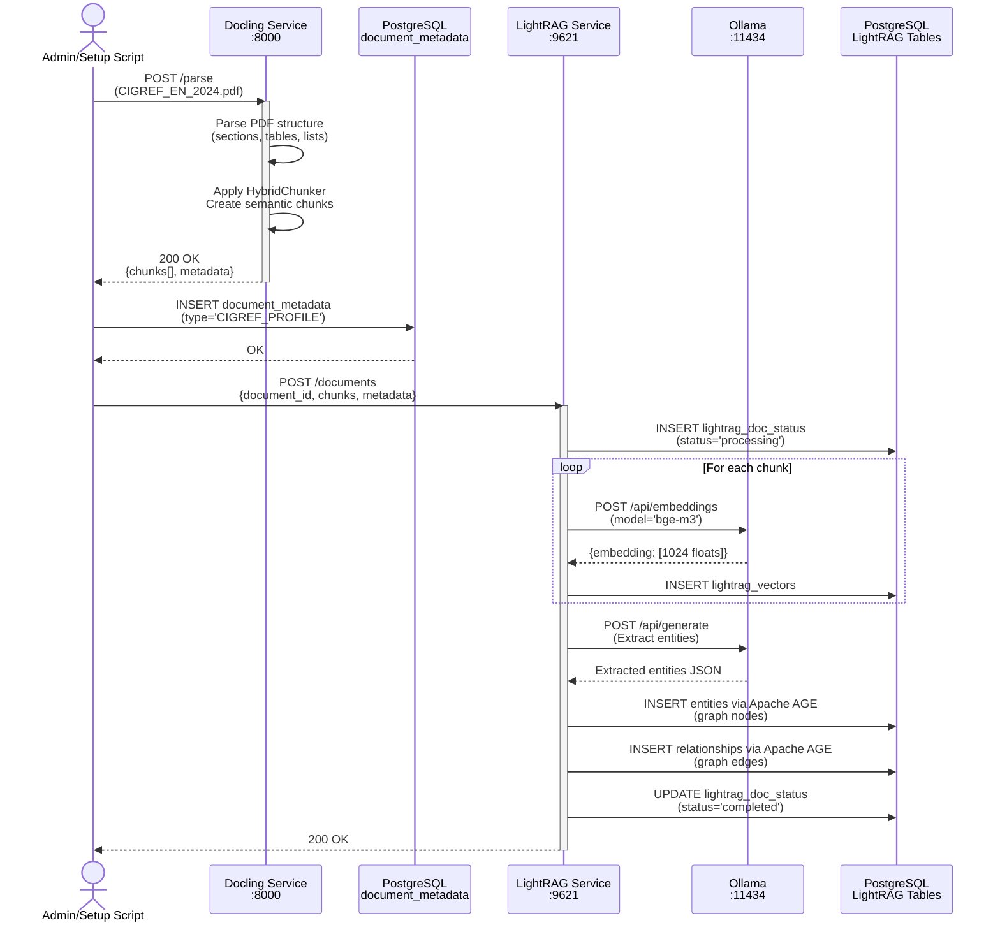
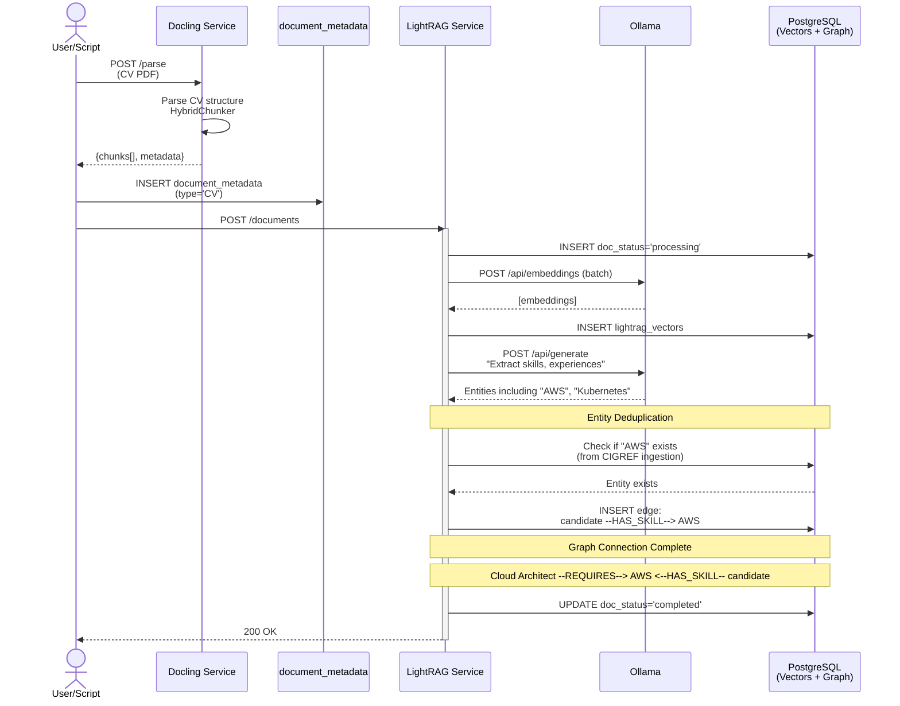
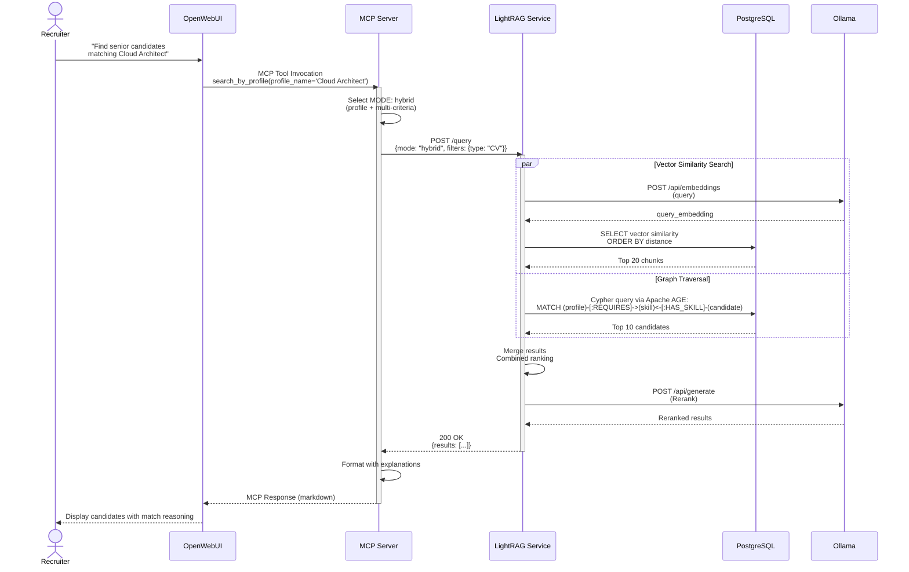

# Core Workflows

## Workflow 1: CIGREF Profile Ingestion

```mermaid
sequenceDiagram
    actor Admin as Admin/Setup Script
    participant Docling as Docling Service<br/>:8000
    participant Meta as PostgreSQL<br/>document_metadata
    participant LR as LightRAG Service<br/>:9621
    participant Ollama as Ollama<br/>:11434
    participant PG as PostgreSQL<br/>LightRAG Tables

    Admin->>Docling: POST /parse<br/>(CIGREF_EN_2024.pdf)
    activate Docling
    Docling->>Docling: Parse PDF structure<br/>(sections, tables, lists)
    Docling->>Docling: Apply HybridChunker<br/>Create semantic chunks
    Docling-->>Admin: 200 OK<br/>{chunks[], metadata}
    deactivate Docling

    Admin->>Meta: INSERT document_metadata<br/>(type='CIGREF_PROFILE')
    Meta-->>Admin: OK

    Admin->>LR: POST /documents<br/>{document_id, chunks, metadata}
    activate LR
    LR->>PG: INSERT lightrag_doc_status<br/>(status='processing')

    loop For each chunk
        LR->>Ollama: POST /api/embeddings<br/>(model='bge-m3')
        Ollama-->>LR: {embedding: [1024 floats]}
        LR->>PG: INSERT lightrag_vectors
    end

    LR->>Ollama: POST /api/generate<br/>(Extract entities)
    Ollama-->>LR: Extracted entities JSON

    LR->>PG: INSERT entities via Apache AGE<br/>(graph nodes)
    LR->>PG: INSERT relationships via Apache AGE<br/>(graph edges)

    LR->>PG: UPDATE lightrag_doc_status<br/>(status='completed')

    LR-->>Admin: 200 OK
    deactivate LR
```

## Workflow 2: CV Ingestion

```mermaid
sequenceDiagram
    actor User as User/Script
    participant Docling as Docling Service
    participant Meta as document_metadata
    participant LR as LightRAG Service
    participant Ollama as Ollama
    participant PG as PostgreSQL<br/>(Vectors + Graph)

    User->>Docling: POST /parse<br/>(CV PDF)
    Docling->>Docling: Parse CV structure<br/>HybridChunker
    Docling-->>User: {chunks[], metadata}

    User->>Meta: INSERT document_metadata<br/>(type='CV')

    User->>LR: POST /documents
    activate LR
    LR->>PG: INSERT doc_status='processing'

    LR->>Ollama: POST /api/embeddings (batch)
    Ollama-->>LR: [embeddings]
    LR->>PG: INSERT lightrag_vectors

    LR->>Ollama: POST /api/generate<br/>"Extract skills, experiences"
    Ollama-->>LR: Entities including "AWS", "Kubernetes"

    Note over LR,PG: Entity Deduplication
    LR->>PG: Check if "AWS" exists<br/>(from CIGREF ingestion)
    PG-->>LR: Entity exists

    LR->>PG: INSERT edge:<br/>candidate --HAS_SKILL--> AWS

    Note over LR,PG: Graph Connection Complete
    Note over LR,PG: Cloud Architect --REQUIRES--> AWS <--HAS_SKILL-- candidate

    LR->>PG: UPDATE doc_status='completed'
    LR-->>User: 200 OK
    deactivate LR
```

## Workflow 3: Hybrid Retrieval Query

```mermaid
sequenceDiagram
    actor User as Recruiter
    participant OW as OpenWebUI
    participant MCP as MCP Server
    participant LR as LightRAG Service
    participant PG as PostgreSQL
    participant Ollama as Ollama

    User->>OW: "Find senior candidates<br/>matching Cloud Architect"

    OW->>MCP: MCP Tool Invocation<br/>search_by_profile(profile_name='Cloud Architect')

    activate MCP
    MCP->>MCP: Select MODE: hybrid<br/>(profile + multi-criteria)

    MCP->>LR: POST /query<br/>{mode: "hybrid", filters: {type: "CV"}}

    activate LR
    par Vector Similarity Search
        LR->>Ollama: POST /api/embeddings<br/>(query)
        Ollama-->>LR: query_embedding
        LR->>PG: SELECT vector similarity<br/>ORDER BY distance
        PG-->>LR: Top 20 chunks
    and Graph Traversal
        LR->>PG: Cypher query via Apache AGE:<br/>MATCH (profile)-[:REQUIRES]->(skill)<-[:HAS_SKILL]-(candidate)
        PG-->>LR: Top 10 candidates
    end

    LR->>LR: Merge results<br/>Combined ranking

    LR->>Ollama: POST /api/generate<br/>(Rerank)
    Ollama-->>LR: Reranked results

    LR-->>MCP: 200 OK<br/>{results: [...]}
    deactivate LR

    MCP->>MCP: Format with explanations

    MCP-->>OW: MCP Response (markdown)
    deactivate MCP

    OW-->>User: Display candidates with match reasoning
```

---
