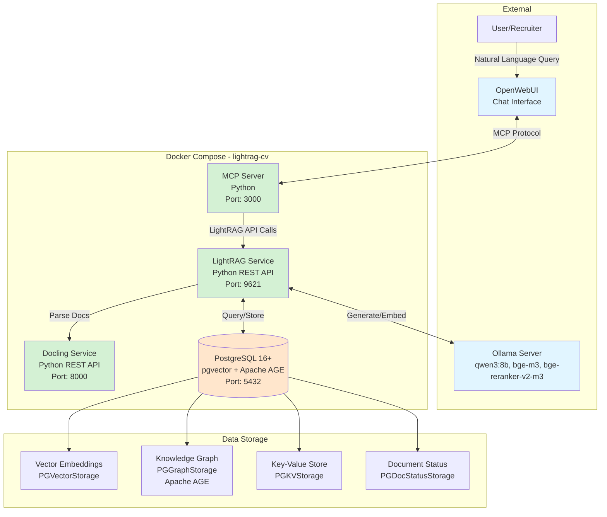

# High Level Architecture

## Technical Summary

LightRAG-CV employs a **containerized microservices architecture** orchestrated via Docker Compose, designed for local deployment on Windows WSL2 with Docker Desktop. The system integrates four core services—Docling (document processing), LightRAG (hybrid vector-graph RAG engine), PostgreSQL (unified persistence with pgvector and Apache AGE extensions), and a custom MCP Server (Model Context Protocol integration)—with external dependencies on Ollama (LLM inference/embeddings) and OpenWebUI (user interface). The architecture leverages hybrid retrieval combining vector similarity search and graph relationship traversal to match IT candidate CVs against CIGREF job profile nomenclature, exposing capabilities through a conversational interface. This POC architecture prioritizes rapid validation of the hybrid RAG hypothesis while maintaining clear service boundaries and data architecture that can scale to production requirements.

## High Level Overview

**Architectural Style:** **Microservices within Docker Compose**

The system follows a microservices pattern with clear service boundaries, containerized for consistent deployment across development and testing environments. While not a full-scale distributed system (appropriate for single-user POC scope), the architecture establishes service isolation principles that enable future scaling.

**Repository Structure:** **Monorepo** (`lightrag-cv/`)

All services, configuration, documentation, and deployment artifacts reside in a single repository following the structure:
```
lightrag-cv/
├── services/          # Service implementations
│   ├── docling/       # Document processing service
│   ├── lightrag/      # RAG engine service
│   ├── mcp-server/    # MCP protocol server
│   └── postgres/      # Database configuration
├── data/              # Reference data and test datasets
├── docs/              # Architecture and requirements
├── scripts/           # Setup and utility scripts
└── docker-compose.yml # Orchestration configuration
```

**Service Architecture:**

1. **Docling Service** - Stateless Python REST API wrapping IBM's Docling library for intelligent document parsing with HybridChunker support. Optionally GPU-accelerated for performance.

2. **LightRAG Service** - Python-based RAG engine from HKUDS/LightRAG, configured with PostgreSQL storage adapters for vectors, graphs, key-value pairs, and document status tracking. Exposes REST API for document ingestion and retrieval operations.

3. **MCP Server** - Custom Python implementation of Model Context Protocol specification, translating OpenWebUI tool invocations into LightRAG API calls and formatting structured responses.

4. **PostgreSQL Database** - Unified persistence layer with pgvector (0.5.0+) for vector similarity search and Apache AGE for graph database capabilities. Serves as single source of truth for embeddings, knowledge graph, and metadata.

**External Dependencies:**

- **Ollama** (host or separate container): LLM inference server providing qwen3:8b (generation), bge-m3 (1024-dim embeddings), and bge-reranker-v2-m3 (reranking)
- **OpenWebUI** (external service): Conversational UI invoking MCP server tools via Model Context Protocol

**Data Flow (Conceptual):**

1. **Ingestion Flow:** PDF/DOCX → Docling parsing → LightRAG ingestion → PostgreSQL storage (vectors + graph)
2. **Retrieval Flow:** OpenWebUI natural language query → MCP Server tool invocation → LightRAG retrieval (hybrid mode selection) → PostgreSQL query (vectors + graph traversal) → Ollama generation → MCP formatted response → OpenWebUI display

**Key Architectural Decisions:**

- **Unified PostgreSQL Storage:** Single database with extensions eliminates multi-database complexity and enables ACID transactions across vectors and graphs
- **Service Communication via REST:** HTTP APIs over internal Docker network provide clear contracts and debugging transparency
- **MCP Protocol Abstraction:** Decouples LightRAG capabilities from OpenWebUI implementation details
- **External Ollama:** Leverages existing LLM inference infrastructure rather than bundling models in containers
- **Configurable Ports:** `.env`-based port configuration prevents conflicts in Docker Desktop environment

## High Level Project Diagram



## Architectural and Design Patterns

- **Microservices Architecture:** Independent services with clear boundaries and REST APIs - *Rationale:* Enables parallel development of Docling, LightRAG, and MCP components; supports future scaling by service; aligns with PRD's service architecture specification.

- **API Gateway Pattern (MCP Server):** Single entry point for OpenWebUI interactions - *Rationale:* Abstracts LightRAG complexity from UI layer; enables intelligent retrieval mode selection; provides unified error handling and response formatting.

- **Repository Pattern (via Storage Adapters):** LightRAG's PGKVStorage, PGVectorStorage, PGGraphStorage, PGDocStatusStorage abstract data access - *Rationale:* Decouples RAG logic from PostgreSQL implementation; enables future database migration if needed; follows LightRAG library's design.

- **Adapter Pattern (Docling Service):** REST wrapper around Docling library - *Rationale:* Decouples document processing from LightRAG service; enables independent scaling and GPU acceleration; provides version isolation.

- **Hybrid Retrieval Pattern:** Combines vector similarity (semantic search) with graph traversal (relationship reasoning) - *Rationale:* Core POC hypothesis - graph relationships improve match quality beyond pure vector similarity; supports explainable recommendations.

- **External Service Integration:** Ollama accessed via HTTP rather than embedded - *Rationale:* Leverages existing LLM infrastructure; avoids bundling large models in containers; supports shared Ollama instance across projects.

- **Configuration as Code:** Docker Compose + `.env` for all infrastructure - *Rationale:* Reproducible environments; version-controlled infrastructure; supports both CPU and GPU profiles for Docling.

- **Stateless Services:** All services except PostgreSQL are stateless - *Rationale:* Simplifies container restarts and updates; state centralized in database; supports future horizontal scaling.

- **Protocol-Based Integration (MCP):** Standard protocol for OpenWebUI integration - *Rationale:* Decouples from OpenWebUI implementation details; enables alternative UIs in Phase 2; follows emerging LLM tooling standards.

---
